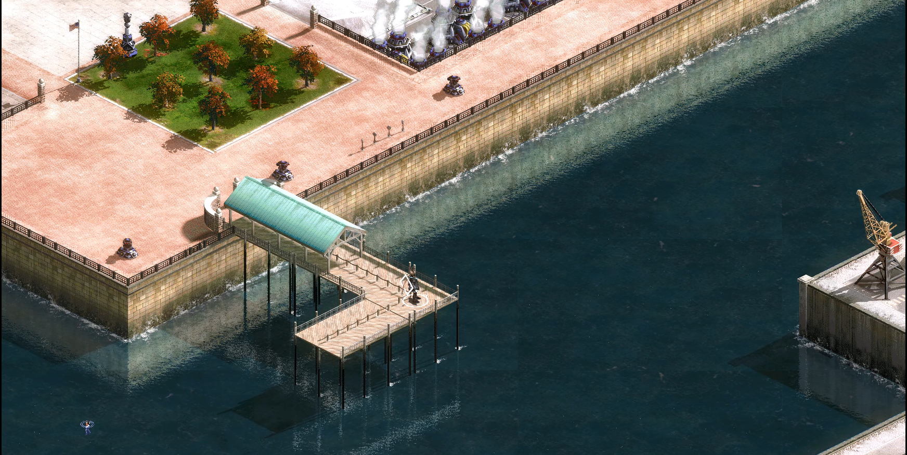
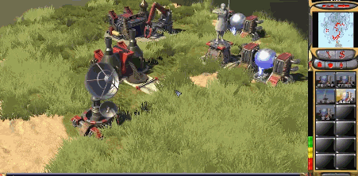
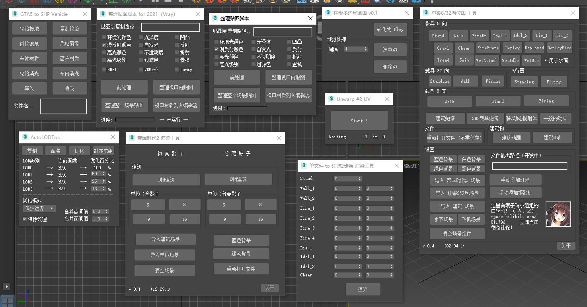
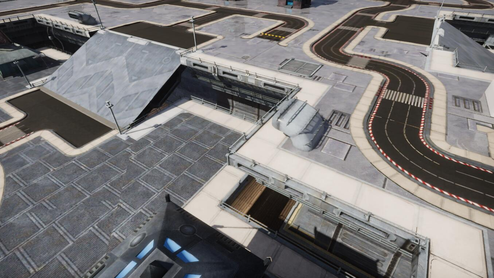
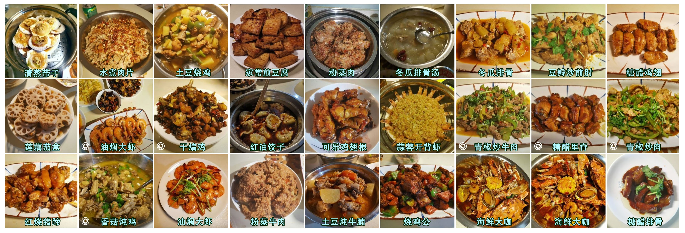
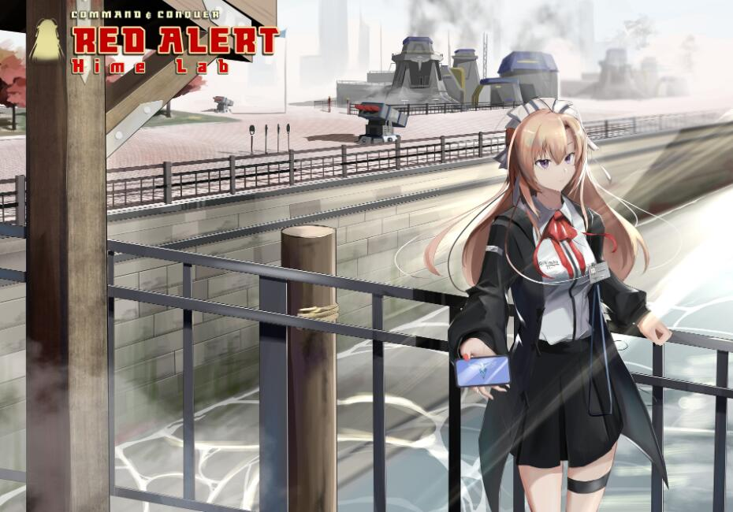

Hola！My name is Dai Ziling, I'm a rookie from Chengdu China 🐼 ~

I love computer games 🎮 when I was child, 3D became my hobby when I was 14. Form that period of time, I began to buy some books 📚 about 3Dsmax, Photoshop.

But Red Alert 2 led me go astray😭, studing useless outdated game modification and struggle on a antiquated game engine waste my lot of years. I leave far and far away form modern GameDev😩.

At 2020, I came back and began learning about the modren game engine(UE4 and Unity)💪, and plus learning, C#, Shader(HLSL), Zbrush, SubstancePainter, Substance Designer and so on.

# Info
* 🏫 **Edu**: China University of Petroleum (Qingdao) , Mechanical Engineering
* 📕 **Blog (Bilibili)**: https://space.bilibili.com/811796
* 📕 **Blog (Chinese Quora)**: https://www.zhihu.com/people/ai-er-zhi-guang-yi-fu
* 🔍 **Interest**: painting & rendering & game modification & cooking

# Overview 

<figure style="display: flex; justify-content: space-between; margin: 0;">
    
</figure>

# Projects

## AnisotropyShaderForUnitySRP

This is an anisotropy PBR shader on Unity SRP, simplely based on distortion in tangent space.
（一个Unity SRP的各向异性PBR shader，基于切线空间的扰动，很简单）

[learn more...](https://github.com/DaiZiLing/Anisotropy-Shader-For-Unity-SRP) 

## Nier:Automata Copied City In Unity SRP
shader practice, WIP

[learn more...](https://github.com/DaiZiLing/Nier-Automata-Copied-City-in-URP) 

## Linearly Transformed Cosine Polygon Light Test In Unity SRP
not complete, there still issue remaining...

[learn more...](https://github.com/DaiZiLing/LTC-Polygon-Light-For-URP) 

## Dual Blur In Unity SRP
post-process practice, Gaussian/Box/Kawase/DualKawase Blur included.

[learn more...](https://github.com/DaiZiLing/My-Unity-Post-Process-Practice) 

## HimeLab

**Red Alert 2 MOD HimeLab** is a **Command & Conquer Red Alert 2 Yuri's Renvenge** mod, a rookie modification on a old isometric style game. Implement on Ares expand platform, exploring a modern way to making old game come back to fresh. Including features such as Reshade post-processing, reforge lighting envioronment, new scene, new level.
（《玲玲实验室》，是一个《红色警戒2》的mod。尝试在古旧的红色警戒游戏引擎上探索较新颖的现代游戏制作技法，使用Ares拓展平台制作。包括了Reshade后处理、全新光照、全新场景、全新战役）

[learn more on MODDB](https://www.moddb.com/mods/hime-lab) and [learn more on Bilibili](https://space.bilibili.com/811796) 

下图三维版为Unity开发的独立游戏，但我是打酱油的（👀）

## Maxscripts

My 3dsmax scripting practice. To accelerate art assets progress, standardize export art assets in the game engine, really noob. Including batch rendering, batch renaming, autoLOD, random placing, etc.
（我的3dsmax 脚本练习集，用以加速美术资产制作，规范美术资产导出进游戏引擎。技术含量实在低下，但至少能够节省美术的时间。包含批量渲染、批量重命名、自动LOD、随机种树等等）

# Articles

Some blogs ...
（一些学习笔记…和帖子）

## Real-Time Rendering (RTR4, games202)

[L3&L4&L5：实时阴影（Real-time Shadows）](https://zhuanlan.zhihu.com/p/471190375) 

[《RTR4》第4章 变换（Transforms）（上）](https://zhuanlan.zhihu.com/p/447927462) 

[非真实感渲染（NPR） - Gooch着色模型](https://zhuanlan.zhihu.com/p/455574304) 

[将镜像模型导入Unity后法线翻转的问题](https://zhuanlan.zhihu.com/p/448079644) 

[运用PS仿色制作动画方法指北](https://bbs.ra2diy.com/forum.php?mod=viewthread&tid=16173) 

[在GTA5中学习RA2地图美化技法](https://bbs.ra2diy.com/forum.php?mod=viewthread&tid=17275) 

[假如红警3加上光线追踪会是什么样子？Unity HDRP实战](https://t.bilibili.com/562068879537592472) 

# Cooking

王刚yyds，跟着做菜就完事啦！

# About name

“戴子玲” 是我很喜欢的一款国产galgame《鸑鷟》中的角色。人设经过二次创作，成为了《玲玲实验室》中的情报官设定。

